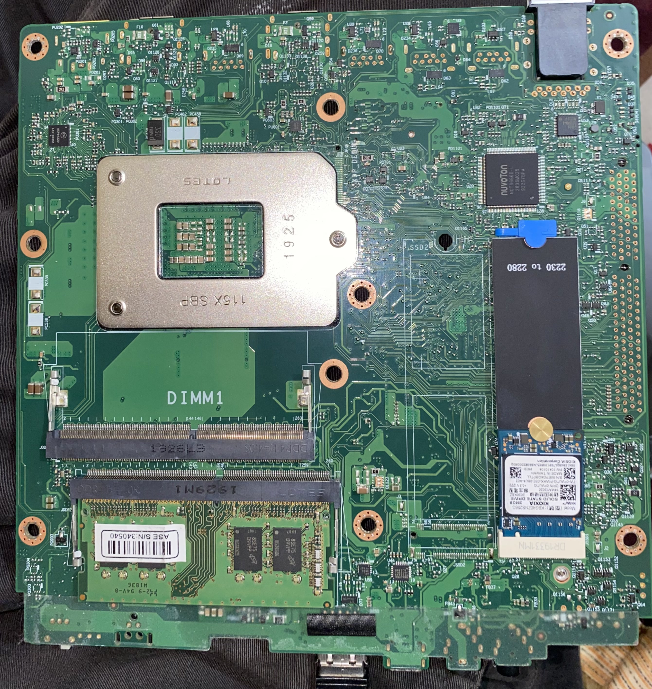
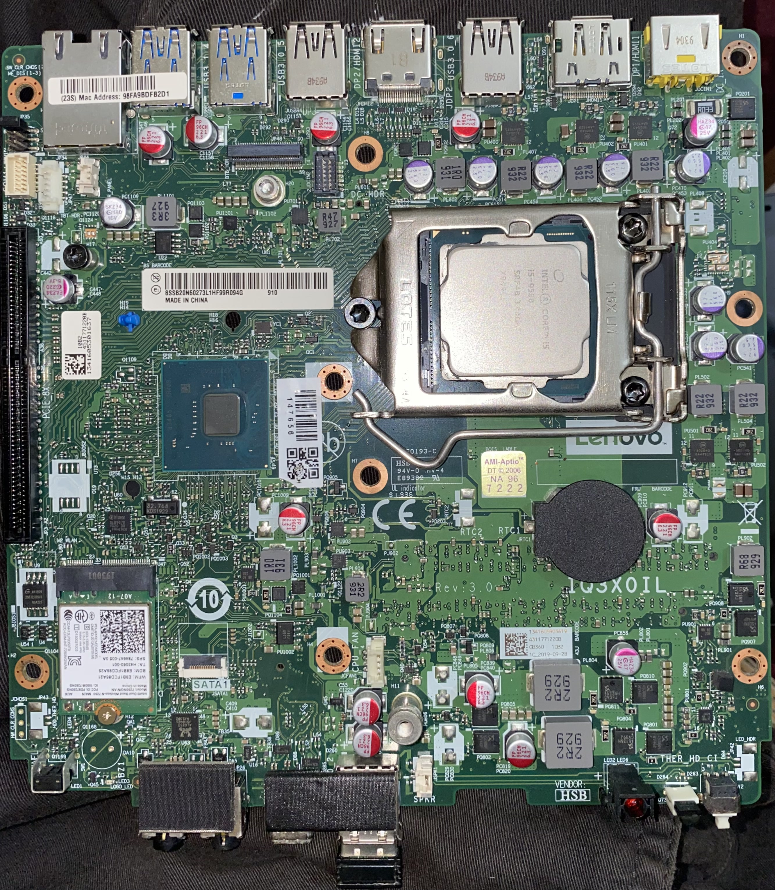
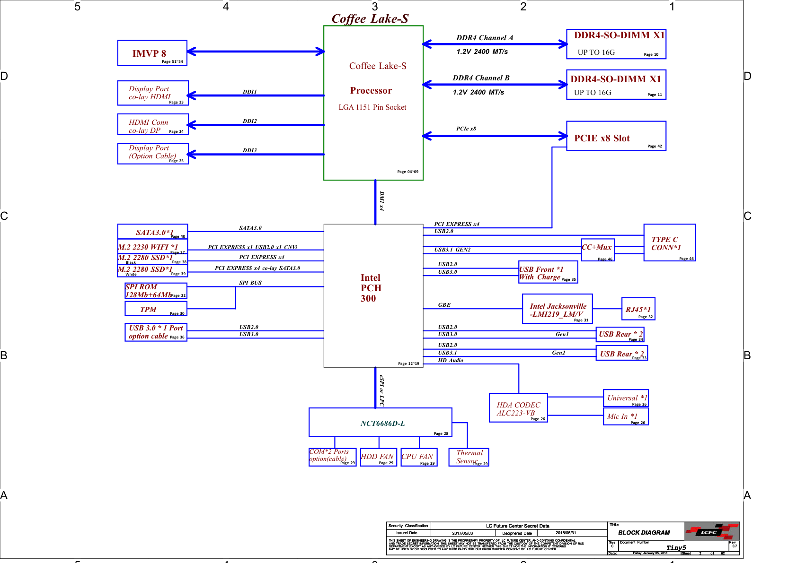
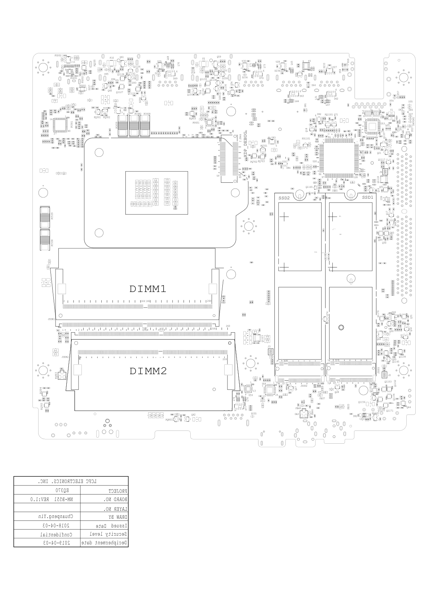
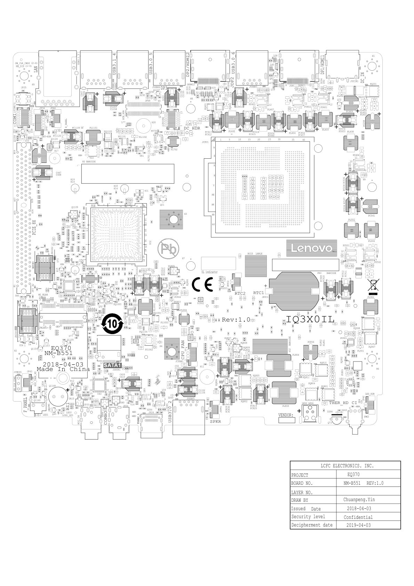
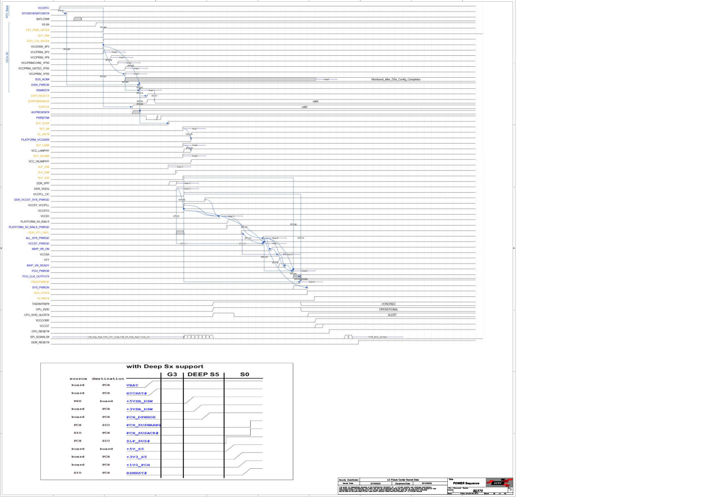

# Lenovo ThinkCentre M720q / M920q / M920x / P330 Tiny
## Motherboard Schematics, Vector Boardview & Technical Hardware Documentation

[](https://www.intel.com/)
[]()
[]()
[]()
[](schematics/Lenovo-ThinkCentre-M720q-M920q-M920x-Schematics-NM-B511-Rev1.0.pdf)
[](https://github.com/roufsweb/Lenovo-M720q-M920q-M920x-Boardview-Schematic/releases/tag/v1.0.0)

Technical documentation, circuit schematics, vector boardview layouts, and high-resolution PCB reference imagery for the Lenovo ThinkCentre Tiny 5th Generation family (M720q, M920q, M920x) and ThinkStation P330 Tiny.

Intended for hardware engineers, diagnostic technicians, and homelab modding applications requiring component-level circuit tracing, power rail diagnostics, and PCIe expansion documentation.

---

## Technical Documents & Direct Downloads

All primary documentation files are maintained directly within this repository:

| File Name | Format | Size | Description | Link |
|:---|:---:|:---:|:---|:---:|
| `Lenovo-ThinkCentre-M720q-M920q-M920x-Schematics-NM-B511-Rev1.0.pdf` | PDF | 3.47 MB | Complete 62-page circuit schematics, IC pinouts, and timing diagrams | [View PDF](schematics/Lenovo-ThinkCentre-M720q-M920q-M920x-Schematics-NM-B511-Rev1.0.pdf) |
| `Lenovo-ThinkCentre-M720q-M920q-M920x-Boardview-NM-B511-Rev1.0.pdf` | PDF | 286 KB | 2-page top and bottom silkscreen component locator layout | [View PDF](schematics/Lenovo-ThinkCentre-M720q-M920q-M920x-Boardview-NM-B511-Rev1.0.pdf) |
| `Lenovo-M720q-Motherboard-Top.jpg` | JPG | 1.74 MB | High-resolution top PCB photography (2680 x 2832) | [View Image](images/Lenovo-M720q-Motherboard-Top.jpg) |
| `Lenovo-M720q-Motherboard-Bottom.jpg` | JPG | 2.02 MB | High-resolution bottom PCB photography (2666 x 3058) | [View Image](images/Lenovo-M720q-Motherboard-Bottom.jpg) |

Cloud mirror: [Google Drive Archive](https://drive.google.com/drive/folders/1PbOBiAmKG6ls85OmZaaPQPaNJitxXBxA?usp=sharing)

---

## Motherboard Layout Reference

### Component Top Side
Top surface overview showing the LGA1151v2 socket, dual DDR4 SO-DIMM slots, PCIe x8 riser header, primary M.2 2280 NVMe slot, M.2 2230 Wi-Fi slot, and front I/O ports.



### Component Bottom Side
Bottom surface overview showing the Intel Q370/B360 PCH, secondary M.2 2280 NVMe pads (populated on M920x/P330), Nuvoton SIO, and dual SPI flash ROMs.



---

## System Architecture & Visual Previews

### System Block Diagram
*Source: Page 2 of schematic documentation (NM-B511 REV 1.0).*

Illustrates the Coffee Lake-S processor interconnects via DMI 3.0 (x4) to the Intel 300 Series PCH, DDR4 memory channels, PCIe 3.0 lanes, display pipelines, and peripheral controllers.



---

### Boardview Component Locator Maps

#### Primary Layer (Top)
Vector layout indicating designators for resistors (R/PR), capacitors (C/PC), inductors (L/PL), transistors (Q/PQ), and integrated circuits (U/PU).



#### Secondary Layer (Bottom)
Component placement map around the PCH, VRM driver circuitry, and memory termination bypass caps.



---

### Power-On Timing Sequence (G3 to S0 State)
*Source: Page 60 of schematic documentation.*

Chronological signal sequence used for diagnosing no-power, no-POST, and sleep state transition faults.



---

## Specifications & Supported Systems

### Compatible Machine Types
| Model | Machine Types | Platform Chipset | PCIe Expansion | M.2 NVMe Slots | Default Thermal Envelope |
|:---|:---|:---:|:---:|:---:|:---:|
| **ThinkCentre M720q Tiny** | `10T7`, `10T8`, `10T9`, `10TA` | Intel B360 / Q370 | PCIe 3.0 x8 (via riser) | 1x M.2 2280 | 35W (65W with heatsink) |
| **ThinkCentre M920q Tiny** | `10RR`, `10RS`, `10RT`, `10RU` | Intel Q370 (vPro) | PCIe 3.0 x8 (via riser) | 1x M.2 2280 | 35W (65W with heatsink) |
| **ThinkCentre M920x Tiny** | `10S0`, `10S1`, `10S2`, `10S3` | Intel Q370 (vPro) | PCIe 3.0 x8 (GPU / NIC) | 2x M.2 2280 (Dual NVMe) | 35W / 65W |
| **ThinkStation P330 Tiny** | `30CE`, `30CF`, `30CG` | Intel Q370 (WS) | PCIe 3.0 x16 mech. / x8 elec. | 2x M.2 2280 (Dual NVMe) | 35W / 65W |

### Motherboard Identification
* **PCB Silk Model:** `IQ3X0IL REV: 1.0` / `NM-B511` (also designated `NM-B551`)
* **Manufacturing Partner:** LCFC Electronics (Hefei) Co., Ltd.
* **Processor Socket:** Intel LGA1151v2 (8th & 9th Gen Intel Core i3 / i5 / i7 / i9, Pentium Gold, Celeron)
* **Memory Support:** Dual-Channel DDR4-2666 / 2400 MHz SO-DIMM, up to 64GB non-ECC
* **Compatible Lenovo FRUs:** `01MN632`, `01MN633`, `01MN634`, `01MN635`, `02CW258`, `5B20U53896`, `5B20U53897`, `5B20U53898`

---

## Primary Integrated Circuits (IC) Directory

| Functional Role | Part Number | Schematic Reference | Technical Function |
|:---|:---|:---:|:---|
| **CPU Core VRM Controller** | ON Semi `NCP81220` | Pages 49-52 | Multi-phase IMVP8 PWM controller for VCCIA, VCCGT, and VCCSA rails |
| **Super I/O Controller (SIO)** | Nuvoton `NCT6686D-L` | Page 21 | LPC interface, fan PWM management, hardware telemetry, power sequencing |
| **Gigabit Ethernet PHY** | Intel Jacksonville `i219-LM` / `i219-V` | Page 43 | 10/100/1000 Mbps network transceiver connected via PCIe/CLK |
| **HD Audio Codec** | Realtek `ALC233VB` | Page 23 | High-definition 4-channel audio codec with integrated headphone driver |
| **USB Type-C Controller** | Realtek `RTS5449` | Page 25 | Front-panel USB-C Configuration Channel (CC) logic and USB 3.1 multiplexer |
| **SPI Flash BIOS ROM** | Winbond `25Q128` (16MB) + `25Q64` (8MB) | Page 20 | Dual SOIC-8 SPI ROMs storing UEFI firmware, Intel ME 12.x, and descriptor |
| **Trusted Platform Module** | Discrete `TPM 2.0 (TCG 2.0)` | Page 22 | Hardware cryptographic processor for secure boot and platform attestation |
| **Main Standby Regulators** | Synchronous Buck DC-DC | Page 55 | Derives `+3.3V_ALW` and `+5V_ALW` from primary `+20V_DC_IN` adapter feed |
| **DDR4 Memory Voltage (VDIMM)**| Synchronous Buck DC-DC | Page 56 | Generates `+1.2V_VDIMM` and DDR4 bus termination rail `+0.6V_VTT` |
| **PCIe +12V Boost Regulator** | Step-Up Boost DC-DC | Page 57 | Provides `+12V_PCIE` to the horizontal PCIe expansion riser |

---

## Schematic Sheet Index (62 Pages)

| Sheet | Circuit Description | Sheet | Circuit Description |
|:---:|:---|:---:|:---|
| **01** | Cover Page, Document Index & Revisions | **32** | DisplayPort B Output Circuit |
| **02** | System Architecture Block Diagram | **33** | M.2 2230-E Key Wi-Fi / Bluetooth / Intel CNVi |
| **03** | SMBus, Clock Distribution & System Resets | **34** | PCH Digital Display Interfaces (DDP, CNVi, XDP) |
| **04** | CPU: DDR4 Memory Interface Channel A | **35** | PCH Clock Generation & CLK_REQ Circuits |
| **05** | CPU: DDR4 Memory Interface Channel B | **36** | Front Panel Power Switch & Diagnostic LEDs |
| **06** | CPU: PCIe PEG, DMI 3.0 & eDP Interface | **37** | PCH Core Decoupling Capacitors |
| **07** | CPU: Clock, Strapping, VID & Debug Lines | **38** | Internal Speaker / Buzzer & SATA FFC Header |
| **08** | CPU: VCCIA, VCCGT & VCCSA Power Input | **39** | System PWRGD Logic & Bleed-Off Circuitry |
| **09** | CPU: Ground (VSS) Pin Map | **40** | **PCIe 3.0 x8 Expansion Header (Riser Slot)** |
| **10** | DDR4 SO-DIMM Channel A Connector | **41** | Rear Dual USB 3.1 Gen1 Port Architecture |
| **11** | DDR4 SO-DIMM Channel B Connector | **42** | Rear USB 3.1 Gen2 Ports & Optical Drive FFC |
| **12** | PCH: DMI 3.0 & High-Speed PCIe Lanes | **43** | Intel Jacksonville i219-LM/V Gigabit Ethernet |
| **13** | PCH: PCIe, SATA 6Gbps & System GPIO | **44** | PCB Mounting Holes & Ground Stitching |
| **14** | PCH: USB 3.0, USB 2.0 & Power Switching | **45** | **Primary M.2 2280-M SSD-1 (White Connector)** |
| **15** | PCH: HDA Audio, JTAG, SMBus & SPI Flash | **46** | **Secondary M.2 2280-M SSD-2 (Black Connector)** |
| **16** | PCH: Low-Speed I2C, UART & Power Control | **47** | SMBus Thermal Sensors & Thunderbolt Header |
| **17** | PCH: Ground (VSS) Pin Distribution | **48** | **DC-IN Power Jack (+20V) & RTC CMOS Battery** |
| **18** | Hardware Straps & Boot Configuration | **49** | NCP81220 IMVP8 PWM Controller Circuit |
| **19** | Intel XDP Debug Header | **50** | CPU VCCIA Phase Inductors & Driver Stages |
| **20** | Dual SPI Flash ROMs (BIOS / ME Firmware) | **51** | CPU VCCGT Graphics Power Circuit |
| **21** | Nuvoton NCT6686D-L Super I/O Controller | **52** | CPU VCCSA System Agent Power Circuit |
| **22** | Discrete TPM 2.0 Cryptographic Processor | **53** | VCCIO 0.95V Linear Power Regulator |
| **23** | Realtek ALC233VB Audio Codec & Combo Jack | **54** | PCH 1.05V Core & Standby 1.8V Regulators |
| **24** | Front USB 3.1 Gen1 Port with Fast Charge | **55** | **+3.3V_ALW & +5V_ALW Primary Buck Regulators** |
| **25** | Realtek RTS5449 Type-C Port Controller | **56** | **DDR4 +1.2V VDIMM & +0.6V VTT Power Rails** |
| **26** | Modern Standby & CEC Power Management | **57** | **PCIe +12V Step-Up Boost Regulator** |
| **27** | RS-232 COM Header & PWM Fan Management | **58** | Overall Power Distribution Tree |
| **28** | Board-to-Board (BTB) Punch-Out I/O Header | **59** | DC/DC Converter Efficiency & Inductor Specs |
| **29** | Deep Sleep Well (DSW) Power Rail Controls | **60** | **System Power-On Sequence Diagram (G3 to S0)** |
| **30** | DisplayPort Connector C Output | **61** | PCH GPIO Configuration Matrix |
| **31** | Punch-Out Option Port (DP / HDMI / Type-C) | **62** | Revision History & Engineering Changes |

---

## Power Diagnostics & Multimeter Reference

For bench diagnostics of non-powering units, measure the following points relative to chassis ground:

```
[DC Adapter Input: +19.5V / +20.0V]
        |
        +--> Page 48: Input Fuse (F1) & Reverse-Polarity Protection
        |
        +--> Page 55: +3.3V_ALW (Always-On Standby Rail)
        +--> Page 55: +5V_ALW (Always-On Standby Rail)
        |
        v  (Power Button Asserted)
        +--> Page 21: SIO (NCT6686D) de-asserts PWRBTN# to PCH
        +--> Page 54: +1.05V_PCH / +1.8V_S5 (Chipset Standby)
        +--> Page 56: +1.2V_VDIMM (DDR4 Main Memory Power)
        +--> Page 57: +12V_PCIE (Riser Boost Circuit)
        |
        v  (PCH asserts ALL_SYS_PWRGD)
        +--> Page 49-52: VCCIA (0.8V - 1.2V), VCCSA (1.05V), VCCGT
        +--> Page 53: VCCIO (0.95V)
        |
        v
   [PLTRST# De-asserted 3.3V -> System Reset Released]
```

### Diagnostic Notes:
* **Dead Board (No Standby Draw):** Measure continuity across input fuse `F1` and test for low-impedance shorts on `+3.3V_ALW` and `+5V_ALW` coils. Resistance to ground under 10 Ohms points to shorted decoupling capacitors or a damaged buck IC.
* **Instant Power Cut (0.5 Second Shutdown):** Inspect high-side MOSFETs in the CPU VCCIA phases (Page 50) and test the `+12V_PCIE` boost converter diode (Page 57).
* **Power LED Amber Pulse:** Indicates failure during memory rail initialization (`+1.2V_VDIMM` / `+0.6V_VTT`) or damaged ME region within the SPI flash.

---

## Hardware Expansion & Modification Reference

### PCIe Riser Card & Rear Baffles
The custom horizontal expansion header accepts low-profile PCIe cards:
* **Lenovo PCIe x16 Riser (x8 electrical):** FRU `01AJ940` / `01AJ929`
* **Rear PCIe Metal Faceplates:** FRU `02YR497` / `01MN893`

#### Verified Expansion Cards:
* **10GbE Network Interfaces:** Intel `X520-DA2`, Intel `X710-DA2`, Mellanox `ConnectX-3 (MCX311A-XCAT)`
* **Multi-Port Gigabit:** Intel `I350-T4` (Quad RJ45), Intel `I225-V` / `I226-V` (2.5GbE)
* **Dedicated Low-Profile GPUs (M920x / P330 cooling assembly required):** AMD Radeon `RX 560`, Nvidia Quadro `P620` / `P1000`, Nvidia `T400` / `T600` / `T1000`

### Dual NVMe Configuration
* **M920x and P330 Tiny:** Factory-fitted with SMD connectors on both primary (top) and secondary (bottom) M.2 positions.
* **M720q and M920q:** Bottom PCB traces are present to the PCH, but the physical M.2 connector and passive power components are omitted on standard production boards.

### Hardware SPI BIOS Recovery
If firmware corruption prevents system boot:
1. Locate the dual SOIC-8 chips adjacent to the PCH on the PCB underside (Page 20).
2. Connect a 3.3V SOIC-8 clip interfaced with a `CH341A` programmer or Raspberry Pi running `flashrom`.
3. Read the flash chip twice and compare SHA-256 hashes to guarantee clean pin contact before programming.

---

## Recommended Viewing Utilities

* **[OpenBoardView](https://openboardview.org/):** Open-source cross-platform viewer for `.cad`, `.brd`, `.bvr`, and `.fz` files.
* **[BoardViewer](http://boardviewer.net/):** Lightweight standalone Windows viewer for boardview formats.
* **Standard PDF Reader:** Any compliant PDF software with vector search functionality for navigating net names and signal lines across sheets.

---

## Notice
Lenovo, ThinkCentre, and ThinkStation are registered trademarks of Lenovo Group Limited. Intel is a registered trademark of Intel Corporation. All schematics and documentation in this repository are published for diagnostics, repair, and educational reference under fair use principles.
